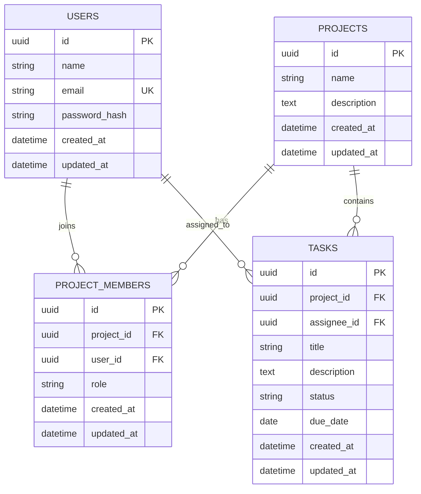

# ERD and Data Model

## Entity Relationship Summary

## Entity: users

Menyimpan akun user.

| Field | Type | Required | Constraint | Description |
| --- | --- | --- | --- | --- |
| id | UUID | Yes | Primary Key | Unique user identifier |
| name | String | Yes | Max 100 | Nama user |
| email | String | Yes | Unique, Max 255 | Email login |
| password_hash | String | Yes | - | Password hasil hashing |
| created_at | Timestamp | Yes | - | Waktu data dibuat |
| updated_at | Timestamp | Yes | - | Waktu data terakhir diperbarui |

## Entity: projects

Menyimpan project.

| Field | Type | Required | Constraint | Description |
| --- | --- | --- | --- | --- |
| id | UUID | Yes | Primary Key | Unique project identifier |
| name | String | Yes | Max 150 | Nama project |
| description | Text | No | - | Deskripsi project |
| created_at | Timestamp | Yes | - | Waktu data dibuat |
| updated_at | Timestamp | Yes | - | Waktu data terakhir diperbarui |

## Entity: project_members

Menyimpan relasi user dan project.

| Field | Type | Required | Constraint | Description |
| --- | --- | --- | --- | --- |
| id | UUID | Yes | Primary Key | Unique membership identifier |
| project_id | UUID | Yes | Foreign Key | Reference ke projects.id |
| user_id | UUID | Yes | Foreign Key | Reference ke users.id |
| role | String | Yes | owner/member | Role user dalam project |
| created_at | Timestamp | Yes | - | Waktu data dibuat |
| updated_at | Timestamp | Yes | - | Waktu data terakhir diperbarui |

### Unique Constraint

- `project_id + user_id` harus unik.

## Entity: tasks

Menyimpan task project.

| Field | Type | Required | Constraint | Description |
| --- | --- | --- | --- | --- |
| id | UUID | Yes | Primary Key | Unique task identifier |
| project_id | UUID | Yes | Foreign Key | Reference ke projects.id |
| assignee_id | UUID | No | Foreign Key | Reference ke users.id |
| title | String | Yes | Max 200 | Judul task |
| description | Text | No | - | Detail task |
| status | String | Yes | todo/in_progress/done | Status task |
| due_date | Date | No | - | Deadline task |
| created_at | Timestamp | Yes | - | Waktu data dibuat |
| updated_at | Timestamp | Yes | - | Waktu data terakhir diperbarui |

## Relationship Rules

- Satu user dapat menjadi member banyak project.
- Satu project dapat memiliki banyak member.
- Satu project dapat memiliki banyak task.
- Satu task hanya berada dalam satu project.
- Satu task dapat memiliki satu assignee.
- Assignee task harus merupakan member dari project terkait.
